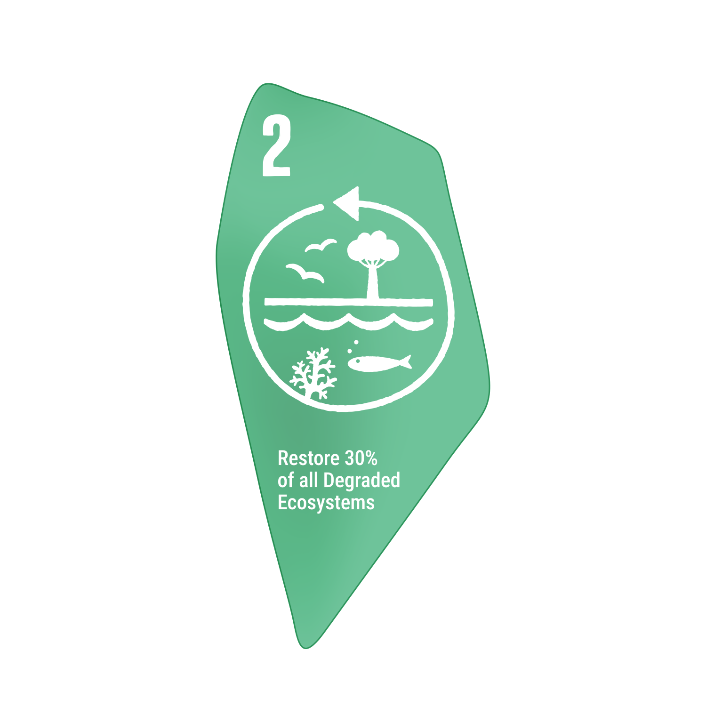
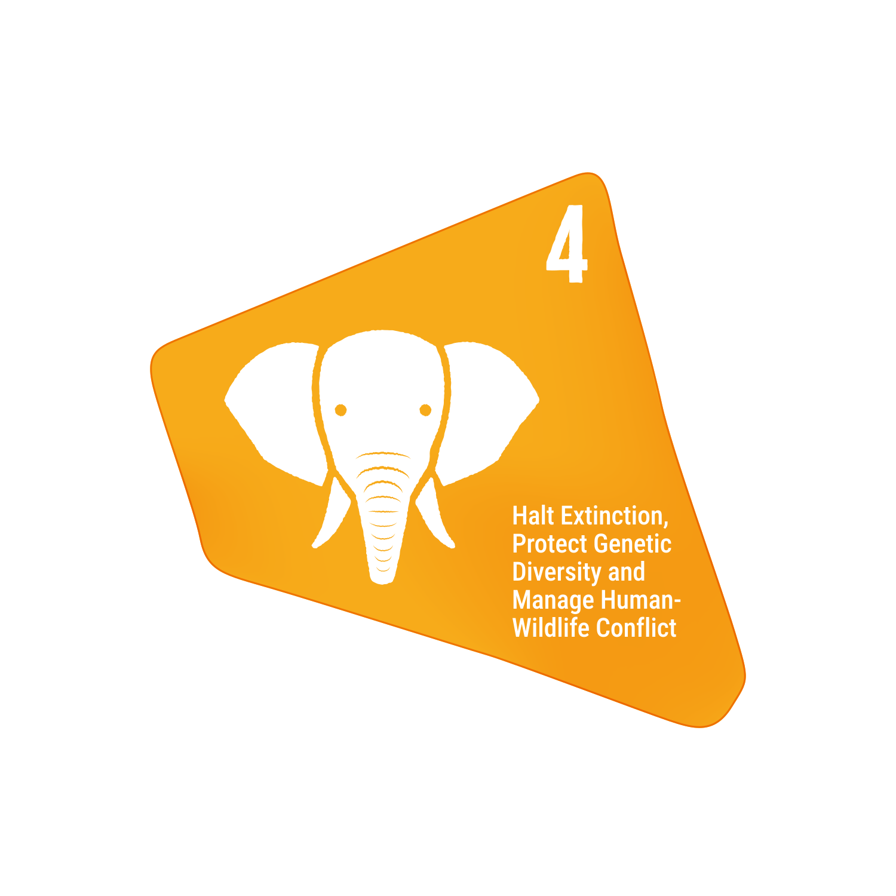
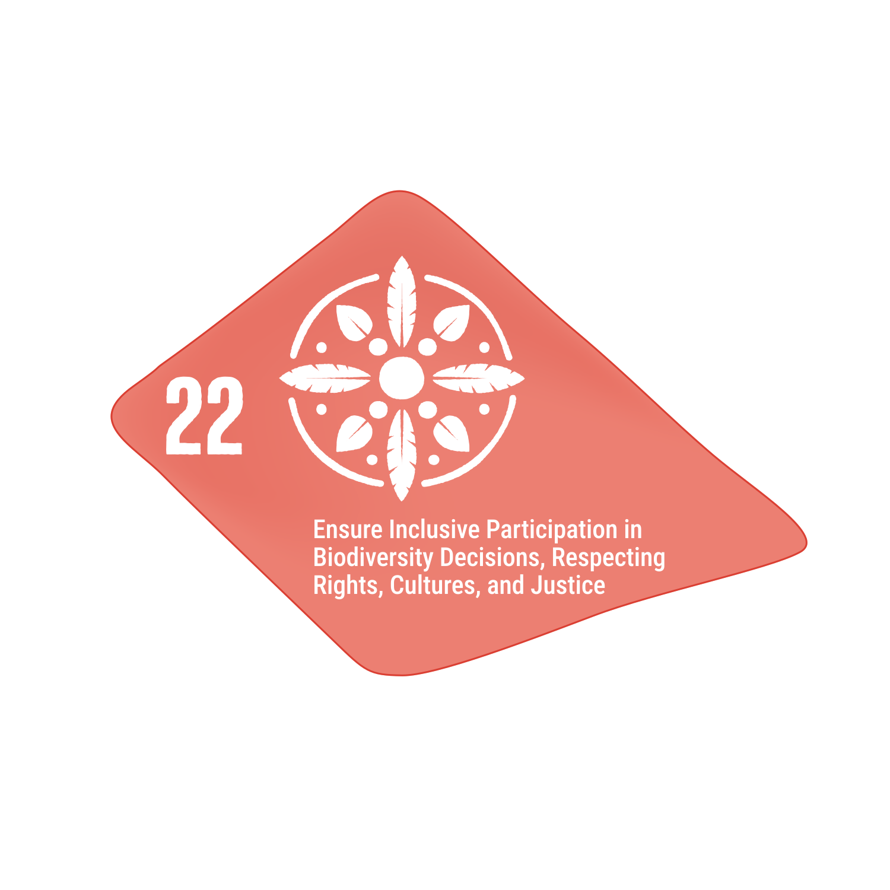

These links provide details about my contributions to the Global Biodiversity Framework.

https://www.cbd.int/gbf/targets

:::{.cr-section}

The Kunming-Montreal Global Biodiversity Framework has 23 targets, and each icon in this *Voronoi* diagram represents one of these targets, forming a unified whole that reflects the interconnectedness of the targets, illustrating the need for global action. @cr-features

:::{#cr-features}

:::

:::{focus-on="cr-features" pan-to="300px,200px" scale-by="3"}
These patches here represents some targets. Follow the links to learn more about my contributions.

[{.gbfs}](gbf/target-20.qmd)

{.sdgs}

:::

:::{focus-on="cr-features" pan-to="200px,300px" scale-by="3"}
And these are other targets:

:::

:::{focus-on="cr-features" pan-to="-100px,300px" scale-by="2"}
And these are other targets:

:::

:::{focus-on="cr-features" pan-to="-200px,-200px" scale-by="3"}
I will add more to these soon:

:::

:::{focus-on="cr-features" pan-to="-120px,220px" scale-by="4"}
But not to this one?

:::

:::

### Target 20

- Target 20: Strengthen Capacity-Building, Technology Transfer, and Scientific and Technical Cooperation for Biodiversity

### Target 21

- Target 21 Ensure That Knowledge Is Available and Accessible To Guide Biodiversity Action

See [GBF Branding guidelines](https://www.cbd.int/gbf/branding)
