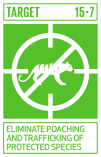

{width=150}

SDG target 15.7’s call for urgent and significant action to stop poaching and trafficing protected species. This target call for countries to measure both the magnitude of poaching and illicit willife traffic and their impact in natural populations.

My research contributes to this goal by exploring various aspects of wildlife trade and hunting practices, providing insights and recommendations for effective interventions. 

## Global illegal parrot trade

The order Psittaciformes is one of the most prevalent groups in the illegal wildlife trade. We conducted a metaanalysis study to review global research on the illegal trade of parrots, analyzing patterns in research aims and actions [@Sanchez-Mercado_2021_IWT_Psittaciformes]. It reveals an exponential increase in research over recent decades, with a focus on American and Australasian genera. The study identifies gaps in understanding supply-side dynamics, actor interactions, and under-explored actions such as protecting areas and livelihood incentives. By highlighting these gaps, the research aims to inform policy-oriented interventions and promote behavior change to combat the illegal parrot trade.

## The impacts of hunting and poaching in Venezuela

In collaboration with researchers from the Venezuelan Institute for Scientific Research (Instituto Venezolano de Investigaciones Científicas, IVIC), the NGO Provita and the Lodz in Poland I have worked with different aspects of poaching and hunting in Venezuela.

:::{.aside}
See also my contributions to  [Target 11.4](/sdgs/target-11-4.qmd)
:::
Wildlife is a fundamental resource for indigenous communities in the Neotropics, but traditional lifelihoods are in constant change as communities try to adapt to new socio-economic realities. In our study [@Stachowicz_2021_Hunting_Gran_Sabana], we evaluated the Garden Hunting hypothesis, which suggests that shifting cultivation schemes may increase wildlife abundance near cultivated areas. Using camera trap surveys and interviews with Pemón indigenous hunters, the research found mixed evidence supporting the hypothesis. While some species were more abundant near cultivated areas, hunting was more focused on forest-dominated locations. The study provides baseline data for wildlife abundance and highlights the need for sustainable hunting practices and wildlife management in the region.

:::{.aside}
See also my contributions to [Target 15.5](/sdgs/target-15-5.qmd)
:::
Illegal hunting, or poaching, is a major threat to large mammals like the [Andean Bear](https://www.iucnredlist.org/species/22066/123792952){target="RLTS"}. In our study by @S_nchez_Mercado_2008 we used regression models to map poaching risks based on 844 presence reports of Andean bears. The analysis showed that poaching risk is significantly lower in protected areas, and is higher in lower altitudes with higher human disturbance. The study suggests that poaching may be driven by opportunistic encounters rather than targeted hunting. By identifying high-risk areas and factors influencing poaching, the research provides valuable insights for targeted conservation efforts to protect Andean bears from poaching.

## Ecosystem level impacts

Degradation of environmental conditions or disruption of biotic processes are emerging risks to American forests, but their effect is often underestimated due to the lack of appropriate indicators and monitoring tools.

In the paper @Ferrer-Paris_2019_RLE_Forests, we  assessed the disruption of biotic processes, specifically defaunation, in tropical mainland macrogroups.  Defaunation, driven by overexploitation of large mammals due to hunting and poaching, was inferred using spatial proxies related to recent declines in large mammal abundance. We approached these threats using indirect indicators of complex shifts in species composition. Although the estimates of defaunation are coarse and indicative of patterns across large regions, our analysis found that functional symptoms contribute to the overall risk of collapse in almost 40% of threatened macrogroups. By applying a suite of indicators to represent different threatening processes, the research underscores the importance of national-level conservation actions and cost-effectiveness analysis to guide future strategies.

---

Check my contributions to [other targets](/impact-SDG.qmd)!