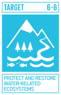

{width=150}

## Global tools

The **IUCN Global Ecosystem Typology** and the **IUCN Red List of Ecosystems** play crucial roles in achieving Sustainable Development Goal 6 (SDG 6), which focuses on ensuring the availability and sustainable management of water and sanitation for all. 

The **IUCN Global Ecosystem Typology** provides a comprehensive function-based classification and support to policy [@Keith_2022_Ecosystem_Typology]. 

The typology provides a detailed framework for classifying and mapping all Earth's ecosystems, including freshwater ecosystems like rivers, lakes, and wetlands. By understanding the functional and compositional features of these ecosystems, we can better manage and protect water resources.

The typology supports global to local policy applications, helping to identify critical ecosystems that are essential for water purification, flood control, and maintaining water cycles. This is vital for implementing effective water management strategies [@Nicholson_2024].

The **IUCN Red List of Ecosystems** is the global standard for risk assessment at the ecosystem level and contributes robust science for measuring the impact of threats, and ecosystem responses to conservation measures [@IUCN_2024].

The Red List of Ecosystems assesses the conservation status of ecosystems, identifying those at risk of collapse. This includes freshwater ecosystems that are crucial for clean water supply and sanitation. By highlighting these risks, it helps prioritize conservation efforts [@Bland_2019_Impact_RLE].

It provides a tool for monitoring the state of ecosystems and measuring the impacts of conservation measures. This ongoing assessment is essential for maintaining healthy water ecosystems, which directly supports SDG 6 targets related to water quality and availability.

Together, these tools provide a robust scientific basis for decision-making and policy development. They help identify which ecosystems are most critical for water-related services and which are under threat, enabling targeted conservation and restoration efforts.

By integrating these tools into national and global water management policies, we can ensure the sustainable use and protection of water resources, contributing directly to the achievement of SDG 6.

## Continental progress

### Freshwater ecosystems in Africa

Africa is strategically important for ecosystem management due to its high ecosystem diversity, significant pressures, and high human dependency on nature. A symposium at the African Protected Areas Congress discussed the role of the IUCN Red List of Ecosystems in designing and managing protected areas (PCAs). 

Africa hosts a significant portion of the world’s freshwater ecosystems, including artesian springs, seasonal floodplains, rivers, and lakes. However, many of these ecosystems remain unevaluated or data deficient. Red-list assessments have been conducted for key freshwater ecosystems in Egypt, the Congo basin, Senegal, Mauritania, and Mozambique [@RLE_Africa].

## Case studies

### Tropical glaciers

Tropical glaciers play a role in the local and regional cycles of water and energy. The glaciers in the top of tropical mountains store vast amounts of freshwater in the form of ice. During warmer months, the melting ice provides a steady flow of water to rivers and streams, contributing to downstream needs for drinking water, agriculture, and hydropower.

These ecosystems support unique micro- and meso-biota  adapted to cold environments. The meltwater from glaciers also contributes nutrients and propagules to downstream ecosystems.

Many communities rely on glacier-fed rivers for their livelihoods, including agriculture, fishing, and tourism. The consistent water supply from glaciers is vital for these economic activities.

Detailed spatial analyses of the rates of changes of tropical glaciers in the Andes and other tropical mountains can inform regional and local strategies for monitoring, management, and conservation, benefiting both people and nature.

Our work supports SDG 6.6 by offering methods to evaluate and mitigate risks to water-related ecosystems, ensuring their sustainability and resilience [@FerrerParis_Glacier_suitability; @FerrerParis_Glacier_Merida_2024].

### Australian alpine bogs

Australian alpine bogs are groundwater-dependent ecosystems found above 1000 m on the Australian mainland and 800 m in Tasmania. They include a number of structural and floristic types including various combinations of high mountain bogs and their associated fens, peatlands and sedgelands. Their  overall water balance is controlled by several factors, but the most important one are the water inputs from groundwater, the capacity for water retention and the outputs by evapotranspiration. Snowpacks contribute minor inputs through slow release of water into the bogs throughout spring and summer thaw. Sphagnum moss grows slowly, a few centimeters each year, but it contributes to create a biogenic structure that enhance water retention in the landscape. As primary production exceeds decomposition, there is considerable formation of peat that becomes a large landscape store for carbon [@Regan_2020_Risk_Alpine].

Australian alpine bogs are characterized by hummock-forming Sphagnum moss, which typically covers at least 30% of the area, along with wet heath shrubs, sedges, and rushes. ​ The structure can range from Sphagnum-dominated to shrub-dominated. ​ There are 12,528 hectares of alpine bogs mapped across the mainland and Tasmania, with less than half of the original extent remaining in Victoria due to various disturbances. ​ Major threats include increased fire frequency, climate change, and introduced ungulates like feral horses. ​ Climate change is predicted to substantially alter the moisture balance in alpine peatlands, putting the ecosystem at risk of collapsing. 

Alpine bogs were assessed as Vulnerable under IUCN criteria, with key indicators being climatological moisture balance, number of dry months, fire frequency, and Sphagnum cover. ​

### Upland swamps in Australia

We studied groundwater-dependent, peat-accumulating, fire-prone wetlands known as upland swamps in southeastern Australia [@Keith_2022_Resilience_Swamps]. 
 
The study investigated how underground mining affects the resilience of groundwater-dependent wetlands in southeastern Australia to landscape fires. We monitored soil moisture and compared the responses of mined and unmined swamps after fires. We found that mined swamps experienced a significant decline in soil moisture and showed strong symptoms of ecosystem collapse, such as loss of peat, reduced vegetation, and altered species composition. In contrast, unmined swamps maintained soil moisture and regenerated vigorously after fires. 

Our findings highlight the importance of early diagnosis and preventative measures to avoid ecosystem collapse due to anthropogenic stressors.

--- 

Check my contributions to [other targets](/impact-SDG.qmd)!